## はじめに {#Intro}

Rは統計用のプログラミング言語です。
他に、特に機械学習の分野ではPythonやJuliaも人気です。

<aside>
  政治学や経済学ではStataという統計ソフトも人気ですが有料という難点があります。
</aside>

また、RStudioはRを便利に使うための統合開発環境 (IDE) です。
RStudio以外にもあるもののデファクトスタンダードになっている感はあります。

RStudioはあくまでRを使いやすくするためのもので、R本体ではありません。
なので、まずはRをインストールしてからRStudioをインストールします。

なお、執筆時点では

- Rのバージョンは3.5.3
- RStudioのバージョンは1.1.463

です。

### 参考になるサイト

- 高知工科大学の矢内勇生先生の[計量経済学（2018年度）](http://yukiyanai.github.io/jp/classes/econometrics1/contents/)と[計量経済学応用（2018年度）](http://yukiyanai.github.io/jp/classes/econometrics2/contents/)の講義ページ
- 拓殖大学の浅野正彦先生の[計量政治学01（2018年度）](https://www.asanoucla.com/%E8%AC%9B%E7%BE%A9%E4%B8%80%E8%A6%A7/keiryo2017/)の講義ページ

## Rの導入 {#Install-R}

### ダウンロード

まずはRの[公式サイト](https://www.r-project.org/)へ行き（右クリックで新しいタブで開くことができます）、`download R`をクリックします。

```{r}

```

次にダウンロードする際のミラーサイトを選びます。
好きな国のものを選んでいいですが、ここでは日本の統計数理研究所のものを選んでおきます。

```{r}
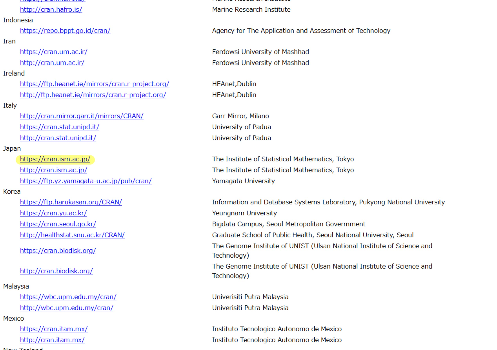
```

自分のPCのOSに応じたものを選択します。

```{r}
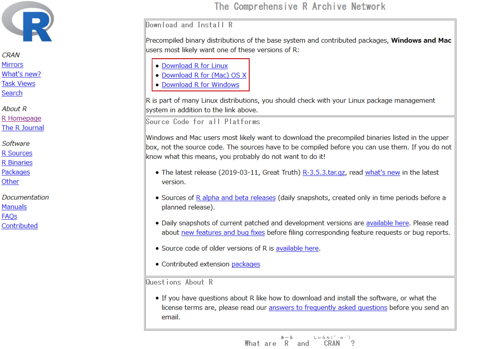
```

`install R for the first time`を選択します。

```{r}
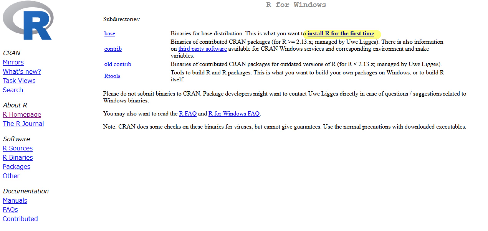
```

`Downlosd R X.X.X for YYY`を選択してダウンロードします。

```{r}
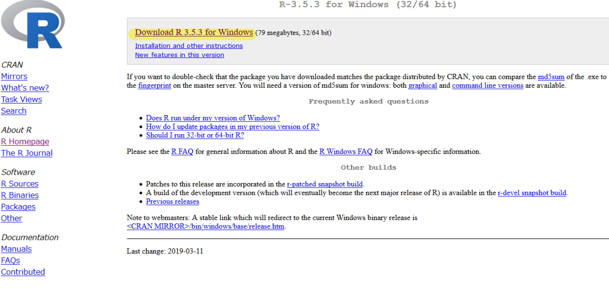
```

分かりやすいようにダウンロードフォルダにダウンロードしておきます。

<aside>
  どのフォルダにダウンロードするのか選択できない場合はブラウザの設定で選択できるようにしておきましょう。
</aside>

### インストール

Rをダウンロードしたフォルダを開き、ファイルをクリックします。

<aside>
  ファイル名はOSによって異なります。
</aside>

その後は表示されるままに進めていけばよいですが、`Message Translations`のインストールにチェックが入っている場合は外しておきましょう。

```{r}
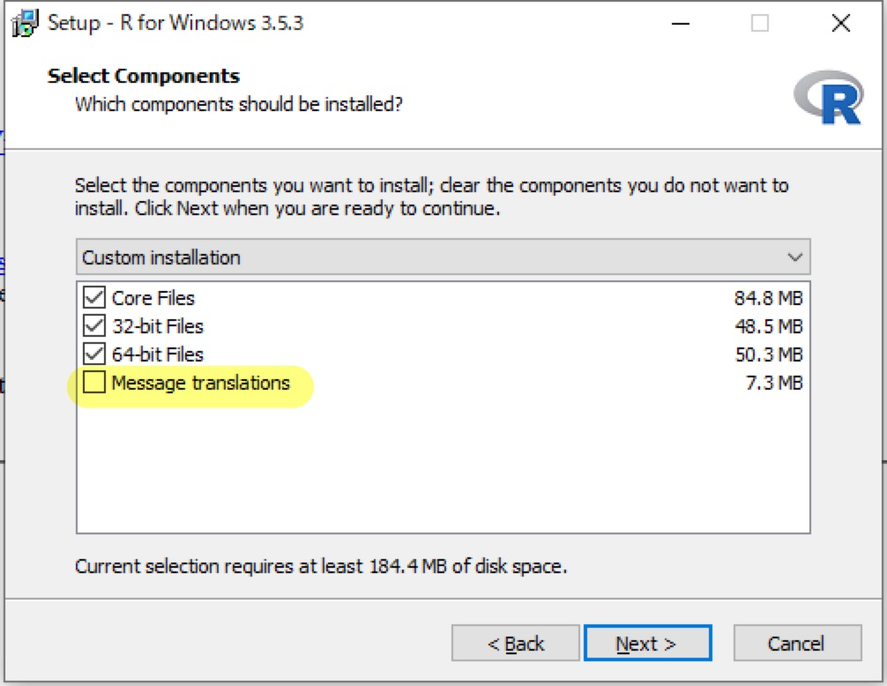
```

こうすることによってエラーメッセージなどが日本語化するのを防ぎます。

<aside>
  英語のエラーメッセージで検索したほうが解決策が見つけやすくなります。
</aside>

## RStudioの導入 {#Install-RStudio}

### ダウンロード

RStudioの[公式サイト](https://www.rstudio.com/)からRStudioのダウンロードサイトへ行きます。

```{r}
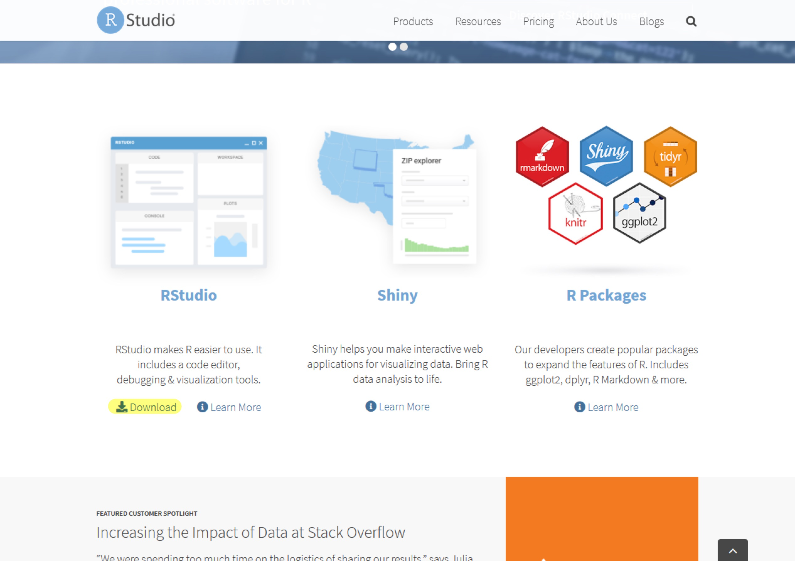
```

下の方にインストーラーをダウンロードするリンクがあるのでOSに応じたものを選択します。

```{r}
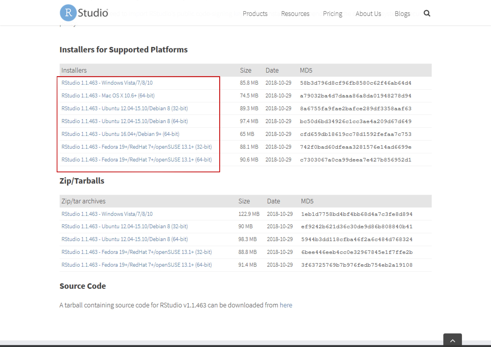
```

- 安定版ではないけれど最新のRStudioを使いたい人は[RStudio Preview](https://www.rstudio.com/products/rstudio/download/preview/)をインストールしてください。
- また、RやRStudioをインストールせずにオンラインで使用できる[RStudio Cloud](https://rstudio.cloud/)というものもあります。

### インストール

あとはダウンロードしたフォルダに移り、インストーラーを起動して表示されるがままに進めていきます。

## RStudioの設定 {#Setup}

RStudioを初めて起動すると次のような表示になるとはずです。
左側の大きなパネルで`R`が表示されていればインストールの成功です。

```{r}
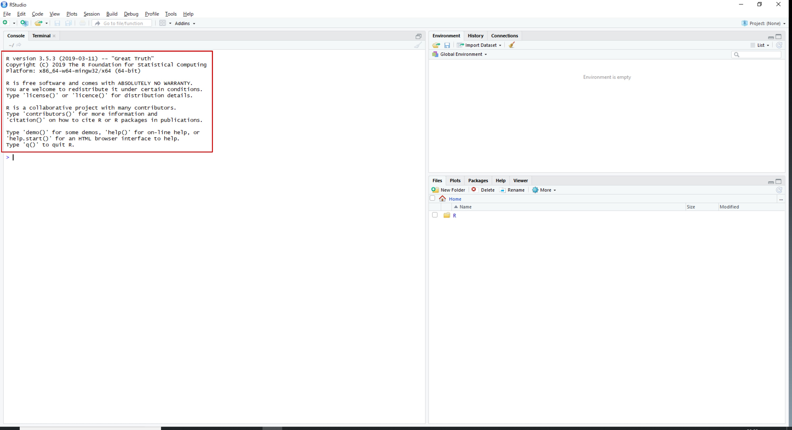
```

### 設定*

`Tools > Global Options`を開き、`Genral`の中で以下のチェックを外します。

```{r}
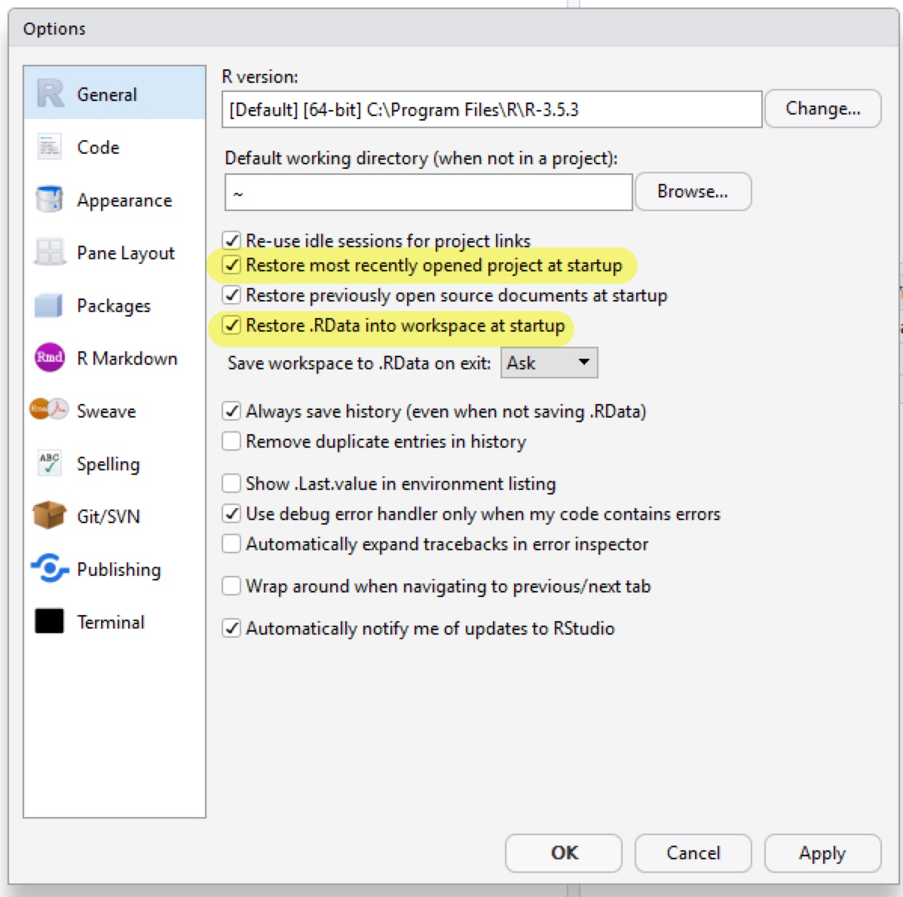
```

- 平たく言うとRStudioを起動したときに前回の続きが残っていない真っさらな状態にしておきます。

また、`Appearance`ではフォントや背景・ハイライトの色を変えることができます。

```{r}
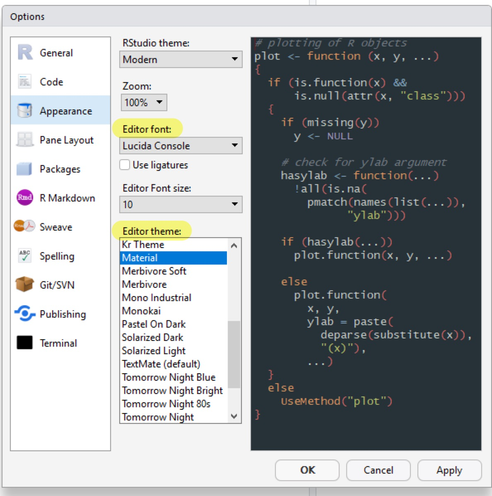
```

ダークな背景を選択するとRStudio全体もダークテーマになります。

```{r}
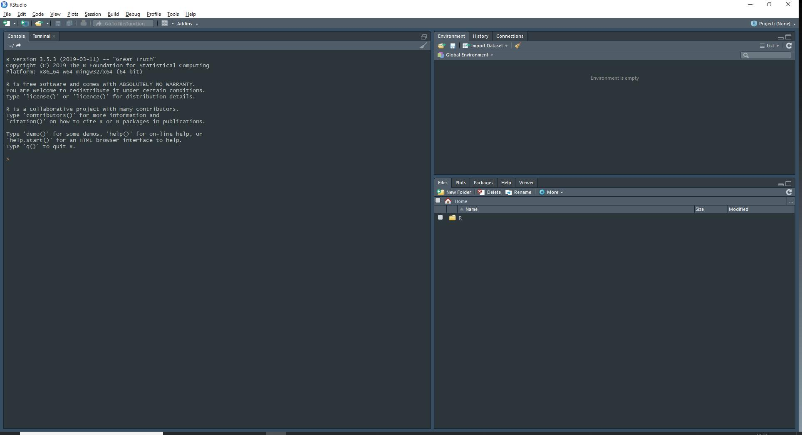
```

日本語がしばしば文字化けすることがあります。
なぜならWindowsではShift-JIS、LinuxとMacではUTF-8と呼ばれるエンコーディング（平たく言うとPCが文字を表示する方法）形式だからです。
UTF-8が世界的に使われているので、`Code > Saving > Default text encoding`を`UTF-8`にしておきます。

```{r}
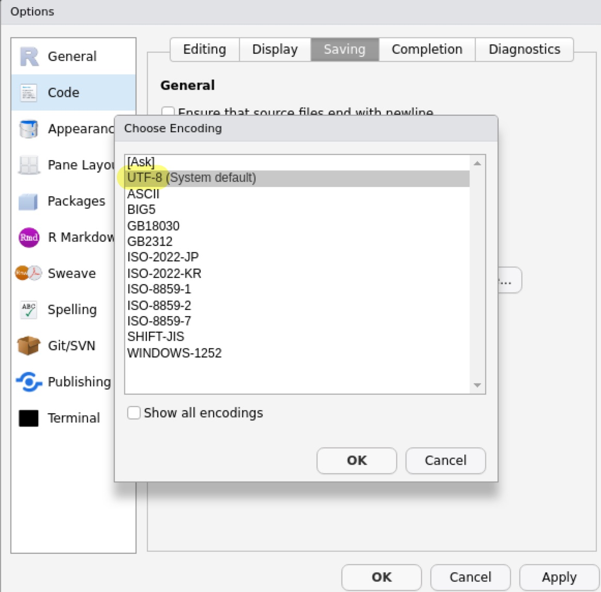
```

もし、日本語を含むファイルをRStudioで開いたときに文字化けしている場合、Windowsを使っている人はUTF-8のファイルをShift-JISで開いたということなので、`File > Reopen with Encoding`で`UTF-8`を選択します。

逆にMacの場合はShift-JISのファイルをUTF-8で開いているので同様に`Shift-JIS`で開きます。

- Windowsの人はUTF-8をデフォルトのエンコーディングにしてしまうといいでしょう。