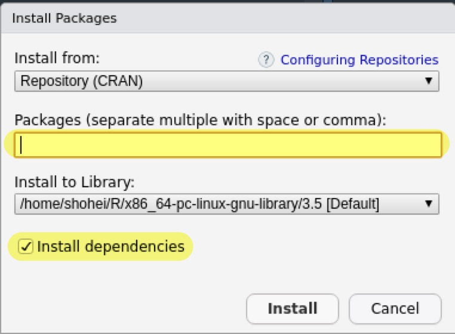
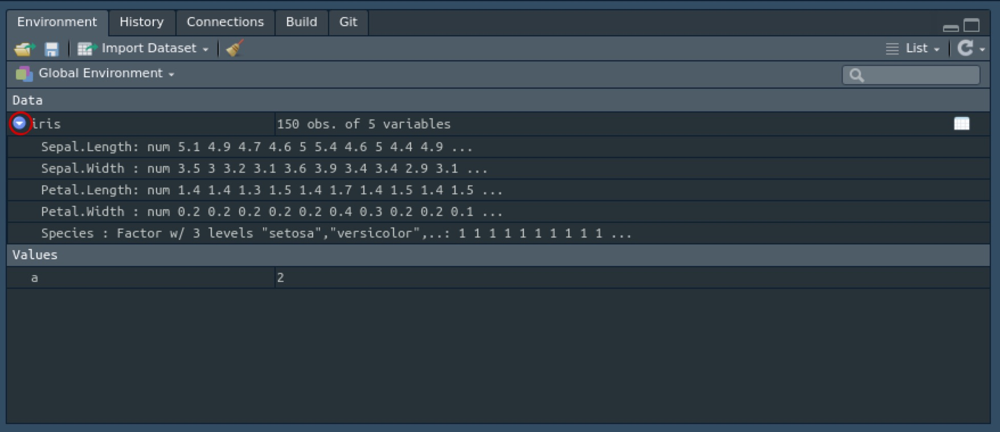

```{r setup, include=FALSE}
knitr::opts_chunk$set(
  echo = TRUE,
  warning = TRUE,
  message = TRUE,
  R.options = list(width = 100)
)
```

## はじめに {#Intro}

Rのコンソールでの操作方法を学びます。
コンソールの`>`の右側にコマンドを打ち込み、`Enter`を押すことで実行することができます。

まず、初めてのプログラミング言語に触るときは`Hello, World!`を出力するのが流儀なので、以下のように実行します。

```{r}
print("Hello, World!")
```

四則演算や冪乗は以下の通りに実行できます。

```{r}
3+2
3-2
3*2
3/2
3^2
```

## 重要な概念 {#Basic}

Rを使う上で重要な概念は

1. オブジェクト
1. 関数
1. パッケージ

になるので、それぞれ説明していきます。

### オブジェクト

Rでは名前をつけてオブジェクトとして保存することができます。
例えば、

```{r}
a <- 2
```

は`2`という数値を`a`という名前のオブジェクトととして生成しています。
実際に、

```{r}
a
```

`a`の中に`2`が入っていることが分かります。

Rでは`<-`を代入記号として用いますが、`=`を使うこともできます。

生成されたオブジェクトを使って計算することもできます。

```{r}
a*3
```

RStudioの場合、右上の`Environment`パネルに生成されたオブジェクトが表示されます。

```{r, echo = FALSE}
knitr::include_graphics("figures/intro_r1.jpg")
```

基本的にRではオブジェクトを作成し、それを加工していく形で分析を行っていきます。

### 関数

関数とは大雑把に言ってしまうと、何かを入力すると特定の処理を行って何かを出力するものです。
Rでは関数は`関数名()`という形で`()`の中に何かを入力します。

実はさっきの`print("Hello, World!")`も`"Hello, World!"`という文字列を`print()`という関数に入力し、文字列を表示させていたのです。

関数は様々にあるので、ここでは簡単なものでイメージを掴んでおきます。

まず、`c()`は複数の要素（ベクトルなど）を一つのオブジェクトとして作成する関数です。
例えば、`1, 3, 5`を要素に持つ`x`というベクトルを作ってみます。

```{r}
x <- c(1, 3, 5)
x
```

これを`sum()`という関数に入力すると総和が出力されます。

```{r}
sum(x)
```

平均を求めるときには`mean()`を使います。

```{r}
mean(x)
```

このように、Rではオブジェクトを関数に入力して処理を行っていきます。

### パッケージ

Rには標準でもいろいろな関数がありますが、世界中で様々な人が関数を作成し、それをまとめたものをパッケージ（ライブラリ）としてCRANやGitHubで公開しています。

これらは全て無料でダウンロードすることができます。
最近では、新しい分析手法を考案した研究者はRやPythonでパッケージを公開することが多いです。
これがRの魅力の一つだと言えます。

パッケージを使うにはインストールと読み込みの2つの手順が必要になります。

#### CRANからのインストール

まず、パッケージをインストールするにはCRANのパッケージであれば`install.packages()`を使うか、RStudioであれば右下の`Packages`パネルから行います。

`Install`をクリックし、

```{r, echo = FALSE}
knitr::include_graphics("figures/intro_r2.jpg")
```

インストールしたいパッケージ名を入力して、

<aside>
  基本的に`Install dependencies`にはチェックを入れておきます。
</aside>

```{r, echo = FALSE}

```

`Install`を選択します。

試しに、`tidyverse`と呼ばれる便利なパッケージをインストールしてみてください。
コマンドで行う場合は、次のようにします。

```{r, eval = FALSE}
install.packages("tidyverse")
```

なお、パッケージのアップデートはRStudioであれば`Packages > Update`、コマンドであれば再インストールによって行えます。

#### パッケージの読み込み

パッケージは一度インストールすると再度インストールする必要はありません。
しかし、パッケージを使う場合は最初に`library()`によって読み込む必要があります。

```{r}
library(tidyverse)
```

#### GitHubからのインストール*

GitHub上のパッケージをインストールする場合は`devtools`というパッケージを使うので、まずはインストールと読み込みを行います。

```{r, eval = FALSE}
install.packages("devtools")
```

```{r}
library(devtools)
```

インストールには`install_github()`を使いますが、入力はパッケージ名ではなく`ユーザー名/レポジトリ名`となる点に注意してください。

## データフレーム {#DataFrame}

Rで統計分析を行う場合、データフレームと呼ばれるオブジェクトを扱うことになります。
基本的には外部からデータを読み込むのですが、まずはデモデータで練習します。

Rやパッケージにはデモデータが含まれています。
`data()`を実行すると一覧が表示されます。
ここでは、有名なフィッシャーのアヤメのデータを使います。

```{r}
data(iris)
```

`Environment`パネルに`iris`が表示されたかと思います。

<aside>
  ちなみにデモデータは`data()`で呼び出さなくても、存在するものとして利用することもできます。
</aside>

### データの概観

データをインポートした際にはどのようなデータなのかをチェックすることが大事です。
`Environment`パネルの`Data`の欄のオブジェクト名（ここでは`iris`）をクリックするとデータの中身を見ることができます。

```{r, echo = FALSE}
knitr::include_graphics("figures/intro_r4.jpg")
```

同様のことは次のコマンドでも可能です。

<aside>
  頭文字が大文字である点に注意してください。
</aside>

```{r, eval = FALSE}
View(iris)
```

必ずしも全てのデータを見る必要はない場合、`head()`によって冒頭の5つまでを見ることができます。

```{r}
head(iris)
```

データフレームでは基本的に横方向（行方向）に観察単位（ここではひとつひとつのアヤメ）があり、縦方向（列方向）に変数（ここではがく片と花弁の長さと幅および品種）が並んでいます。

各変数の記述統計を見たい場合は`summary()`を使います。

<aside>
  `summary()`は総称関数と呼ばれるもので入力するオブジェクトの種類によって挙動が変わります。
</aside>

```{r}
summary(iris)
```

数値データについては最小値、25%分位点、中央値、平均値、75%分位点、最大値が表示され、カテゴリカル変数についてはそれぞれの値の観察数が表示されます。

`str()`によって観察数（サンプルサイズ）、変数の数、変数の種類を確認することもできます。

```{r}
str(iris)
```

同様のことは、`Environment > Data`のオブジェクト名の左の青い丸ボタンを押してもできます。

```{r, echo = FALSE}

```

### データの要素へのアクセス

データを加工するためにはデータの要素へアクセスする必要があります。

#### 変数へのアクセス

変数にアクセスする場合、`オブジェクト名$変数名`のように`$`を使います。

<aside>
  `$`で要素にアクセスするのはS3クラスと呼ばれるオブジェクトで、S4クラスの場合は`@`を使います。
  現在はS3クラスが主流ですが次第にS4クラスが主流になると思われます。
</aside>

```{r}
iris$Species
```

ほぼ同じことが`iris["Species"]`でもできます。

<aside>
  前者の場合はベクトル、後者の場合はデータフレームとして抜き出しています。
</aside>

変数名ではなく列番号でも指定できます。

```{r}
iris[,5]
```

列番号なので、カンマの右側で指定している点に注意してください。

マイナスを使うと、それ以外を指定します。

```{r}
head(iris[,-5])
```

ベクトルで複数の変数を指定することもできます。

```{r}
head(iris[,c(1,3)])
```

#### 観察へのアクセス

特定の観察にのみアクセスすることもできます。

```{r}
iris[1,]
```

これは1番目の観察にアクセスしていますが、行番号で指定しているので、カンマの左側にあります。

あまり意味はないですが、行と列を同時に指定することもできます。

```{r}
iris[1,1]
```

実際には特定の条件に合致した観察のみを抜き出すことが多いです。
例えば、`Species`が`versicolor`であるものだけを抜き出す場合には

```{r}
head(iris[iris$Species == "versicolor",])
```

とします。

これは何をしているのでしょうか？

行を選択しているのは`iris$Species == "versicolor"`ですが、左辺は先程見たように品種を抜き出しています。
そして、`==`は右辺と左辺が一致しているかどうかを判定する記号になります。
実際に、これだけを実行してみると

```{r}
iris$Species == "versicolor"
```

となります。
つまり、`iris$Species == "versicolor"`は`iris`データの`Species`のなかで`versicolor`と一致するものを`TURE`、一致しないものを`FALSE`としており、`TRUE`だけの列を指定することで特定の観察だけにアクセスしてるということになります。

### データの加工

アクセスした要素を上書きすることでデータを加工することができます。
例えば、`Sepal.Length`を10倍にするには以下のように行います。

```{r}
iris$Sepal.Length <- 10*iris$Sepal.Length
head(iris)
```

`$`以降を新しい変数名とすることで変数を新たに加えることができます。

```{r}
iris$Petal.LengthXWidth <- iris$Petal.Length * iris$Petal.Width
head(iris)
```

もちろん、列を指定することで特定の条件に合致したサンプルの変数だけを加工することもできます。
例えば、`stosa`の`Sepal.Length`だけをもとに戻します。

```{r}
iris[iris$Species == "setosa",]$Sepal.Length <- 
  iris[iris$Species == "setosa",]$Sepal.Length/10
head(iris[iris$Species == "setosa",])
head(iris[iris$Species == "versicolor",])
```

## おまけ {#Appendix}

Rで困ったときにすることは、まずググることです。
特に英語でググるといいでしょう。
エラーメッセージが出たときはそれをそのままコピペして検索します。

他に、Rの情報を知りたいけど余計な情報が混ざっているときは[seekR](http://seekr.jp/)で検索します。

[Stack Overflow](https://stackoverflow.com/)はRに限らずPCやプログラミングについて質問する掲示板です。

[r-wakalang](https://github.com/tokyor/r-wakalang)というSlackもあるそうです。

[Qiita](https://qiita.com/)は様々なプログラミングに関する情報を共有するサイトです。

関数の使い方が分からないときはヘルプを見ましょう。
例えば`mean()`のヘルプを見たいときは

```{r, eval = FALSE}
?mean
```

もしくは

```{r, eval = FALSE}
help(mean)
```

でヘルプを表示させることができます。

同じものは[CRAN](https://cran.r-project.org/)にあるパッケージのドキュメントにもあります。

パッケージを作成した研究者はしばしば[Journal of Statistical Software](https://www.jstatsoft.org/index)に使い方に関するペーパーを載せているのでそれも参考になります。

<aside>
  JCRによれば2017年のJSSのIFは22.7らしいです。
</aside>