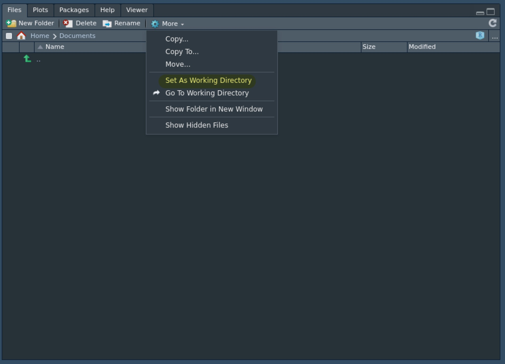
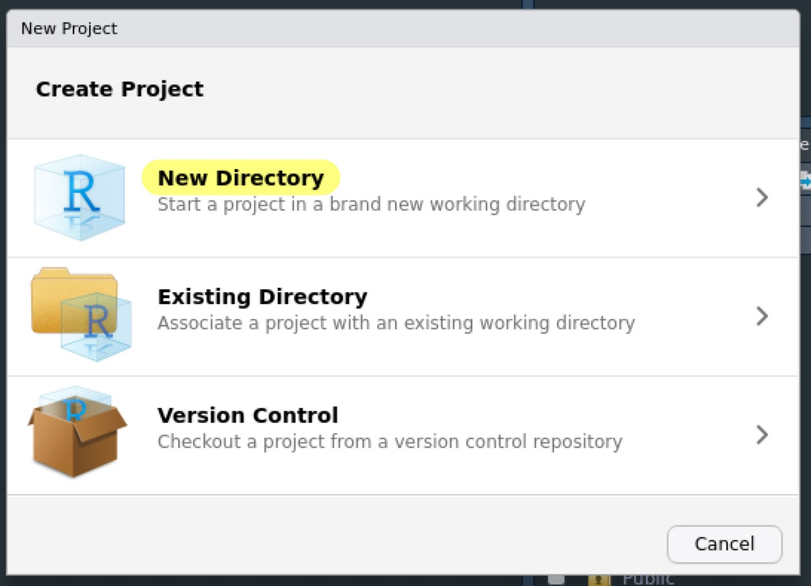
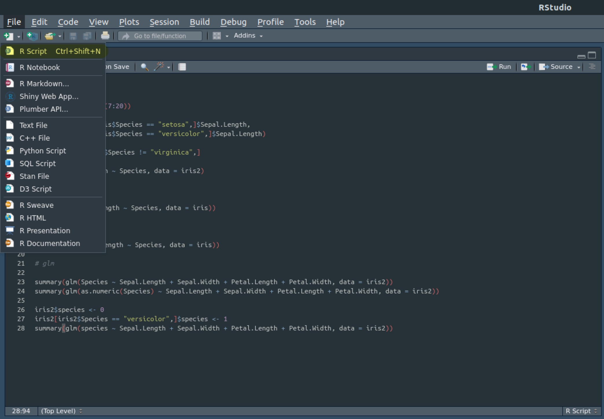

```{r setup, include=FALSE}
knitr::opts_chunk$set(
  echo = TRUE,
  warning = TRUE,
  message = TRUE,
  R.options = list(width = 100)
)
```

## はじめに {#Intro}

ここではRStduioを使うことを前提に、Rで統計分析をする際に便利な分析の流れについて説明します。

### ファイルとフォルダ

一般的に、PCのデータは**ファイル**と呼ばれ、ファイルを入れておく箱のようなものを**フォルダ**（ディレクトリ）と呼びます。

例えば、Windowsの場合、documentsやpicturesというフォルダがあり、その中にWordファイルや画像データが入っていると思います。

なお、ファイルの名前の末尾には`.`から始まる**拡張子**がついています。
例えば、Wordファイルであれば`.docx`、画像データであれば`.png`や`.jpg`などです。
これはそのファイルがどのような種類のもので、PCがどのように処理をすればいいのかを示す目印になっています。

<aside>
  もし、PCで拡張子が表示されていない場合は表示するように設定しましょう。
</aside>

### パス

ファイルやフォルダにアクセスする場合、**パス**と呼ばれるPC上の住所のようなもので指定する必要があります。

例えば、Windowsの場合、documentsフォルダの中の`sample.docx`というファイルのパスは`C:/Users/Shohei/Documents/sample.docx`となります。

<aside>
  正確には、Windowsでは`/`ではなく円マークになっていると思います。
</aside>

#### 絶対パス

このパスの意味はCドライブの中の`User`というフォルダの中の`Shohei`というフォルダの中の`Documents`というフォルダの中にある`sample.docx`という意味です。

このように始点（Windowsの場合はCドライブ）から始めるパスを**絶対パス**と呼びます。

#### 相対パス

しかし、毎回、絶対パスを書くのは面倒ですし、コードを公開する際にはやや恥ずかしい嫌いもあります。

そこで、途中から書かれるパスを**相対パス**と呼びます。
例えば、`Shohei`というフォルダから見れば、上記のファイルは`Documents/sample.docx`として指定することができます。

#### パスに関する注意点

必ずしも直ちに問題があるわけではないですが、パスに日本語や空白があるとうまく行かないことがあります。
なので、フォルダ名やファイル名はアルファベットで空白を入れない方がいいでしょう。

<aside>
  もしユーザー名が日本語である場合、パス関連でエラーが出る場合は[RStudio Cloud](https://rstudio.cloud/)を使うか、これを機にOSをクリーンインストールをしてしまうのもありでしょう。
</aside>

### 作業ディレクトリ

相対パスでファイルなどを指定する際には出発点となるフォルダを決める必要があります。
これを**作業ディレクトリ**と呼びます。

Rでは`getwd()`（"get working directory"の略）で現在の作業ディレクトリを確認できます。

また、`setwd()`に適当なパスを入力することで作業ディレクトリを設定することもできます。

RStudioの場合は`Files`パネルの中の`More > Set As Working Directory`で現在開いているフォルダを作業ディレクトリに指定することもできます。

```{r, echo = FALSE}

```

試しに適当なフォルダを作業ディレクトリに指定してみてください。

作業ディレクトリを設定することのご利益は後々分かります。

### ワークスペース

Rでは作成したオブジェクトなどをまとめて**ワークスペース**と呼びます。
大雑把に言えばRStudioの`Environment`パネルに表示されているもの、と思っておいて問題ありません。

よくあるのは分析をしていくうちにワークスペースがごちゃごちゃしてきて、思ってもいなかった動作を引き起こすことがあります。

- 例えば、自分が作った`data`というオブジェクトが試行錯誤していくうちに全然違う中身になっていたけれど気付かずに分析したら変な結果になっている、と言った具合です。
- あるいは別の分析で使っていた`data`が残ったまま別の分析をしてしまう、ということもあります。

そういうときには`rm(list=ls())`を実行してワークスペースの内容を全て削除して、新たに分析し直します。

## プロジェクト {#Project}

ということも一昔前はありましたが、RStudioを使うのであればこのような心配もありません。
RStudioでは**プロジェクト**を作成することで上記の手間を省くことができます。

### プロジェクトの作成

まずは、プロジェクトの作り方ですが、RStudioの左上の青いボタンをクリックします。

```{r, echo = FALSE}
knitr::include_graphics("figures/workflow2.jpg")
```

続いて、新たにプロジェクト用のフォルダを作るのであれば`New Directory`を、既存のフォルダをプロジェクト用にするのであれば`Existing Directory`を選択します。

```{r, echo = FALSE}

```

基本的には`New Project`を選択します。

```{r, echo = FALSE}
knitr::include_graphics("figures/workflow4.jpg")
```

最後に、プロジェクト用のフォルダの名前とそのフォルダを置くフォルダのパスを指定して`Create Project`をクリックします。

<aside>
  既存のフォルダを使う場合はパスを指定するだけです。
</aside>

```{r, echo = FALSE}
knitr::include_graphics("figures/workflow5.jpg")
```

- 例えば今回は`Documents`フォルダの中に`test`という名前のプロジェクトを作成しました。

一度、RStudioを終了し、先程指定したパス通りの場所にフォルダができていることを確認してください。
そのフォルダの中に、プロジェクト名と同じ名前の`.Rproj`ファイルができているはずです。

### プロジェクトの起動

それをダブルクリックしてみるとRStudioが起動されます。
このとき、すでに作業ディレクトリはプロジェクト用フォルダに指定されているのです（確認してみてください）。

<aside>
  Dropboxで共有している場合、どのPCからアクセスしてもちゃんとパスは通るので便利です。
</aside>

また、ワークスペースはプロジェクトごとに隔離されており、さらに`Tools > Global Options`の`Genral`の中で`Restore .RData into workflow at startup`のチェックを外しておくと、プロジェクト内でもワークスペースはまっさらな状態で起動します。

```{r, echo = FALSE}
knitr::include_graphics("figures/Rstudio4.jpg")
```

### ワークスペースの保存と再開*

どうしても一度分析を中断して、再開したい場合はワークスペースを保存しておきましょう。
上記画面で`Save workflow to .RData on exit`が`Ask`になっている場合、RStudioを終了する際にワークスペースを保存するのか聞かれるはずなので、保存します。

<aside>
  ちなみに、`.RData`ファイルはRのワークスペース（の一部）を保存するデータ形式です。
</aside>

すると、フォルダ内に`.RData`ファイルができるので、再開するときに`load()`に当該ファイルのパスを入力して実行するとワークスペースが復元されます。

## Rスクリプト {#Script}

Rで本格的に分析する際、何度も繰り返し同じコードを打ち込むのはとても手間です。
また、他の人とコードを共有するのも難しいです。

### スクリプトを開く

そういう場合、**Rスクリプト**を作成すると便利です。
百聞は一見にしかずなので、[Rで統計分析](../2019-04-04-stats-r/index.html。)のコードをまとめた[Rスクリプト](codes/stats-r.R)を適当なフォルダにダウンロードしてください。

RスクリプトをRStudioで開くには左上の`File > Open File`で選択します。

```{r, echo = FALSE}
knitr::include_graphics("figures/workflow6.jpg")
```

すると、RStudioの左上に新しいパネルが登場しますが、ここはスクリプトのエディタになります。

### スクリプトを実行する

スクリプト上で``Ctrl + Enter`を押すと、カーソルのある行（途中で改行している場合はひとかたまり全体）が下のコンソールに流れて実行されます。

複数行をドラッグして選択すると同時に実行することができます。

### スクリプトを作成する

スクリプトを作成する場合は左上の白いボタンをクリックして`R Script`を選択します。

```{r, echo = FALSE}

```

ちなみに、Rスクリプト中で`#`以降はコメントとして実行されなくなります。

```{r}
1+2 #ここは無視されます
```

## まとめ {#Concl}

ここまでをまとめると、

1. 分析を始めるときには、まずプロジェクトを作成する。
1. 分析内容はRスクリプトに書いて実行する。

というのがRの基本的な分析の流れのになります。

なぜこうするとよいのかは次第にわかってくると思います。