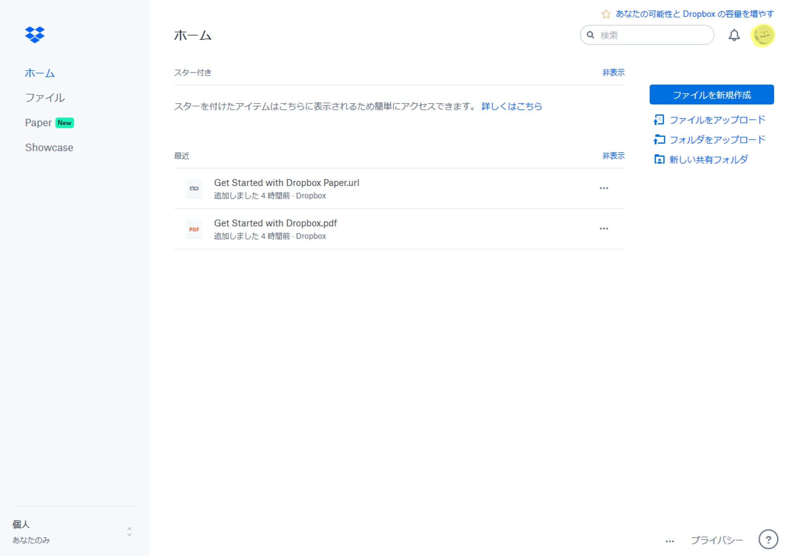
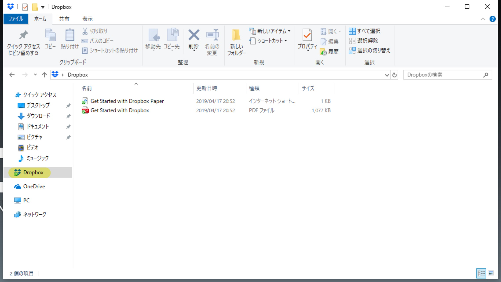
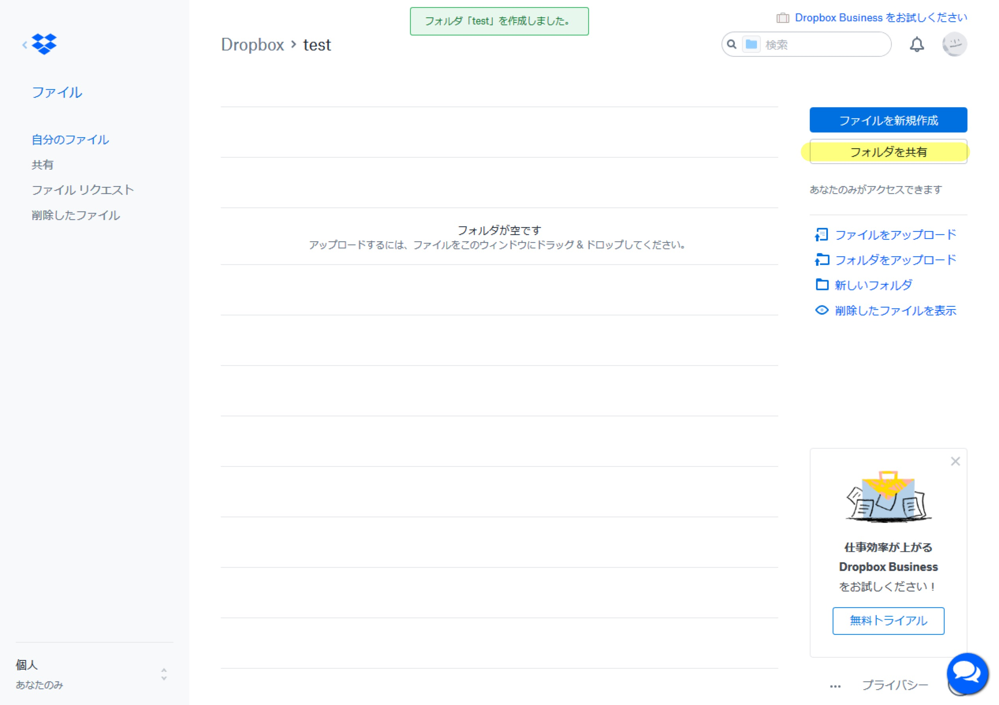
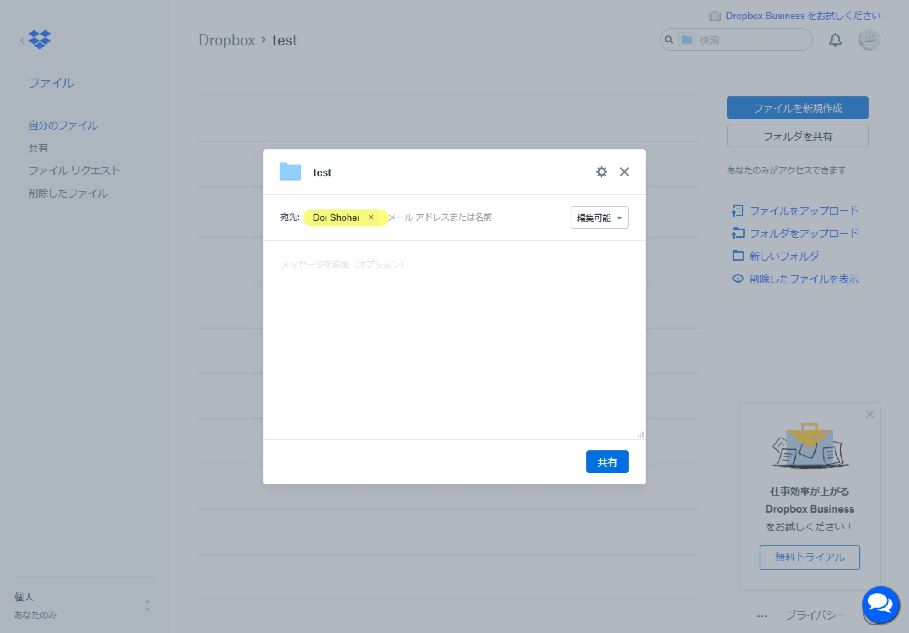
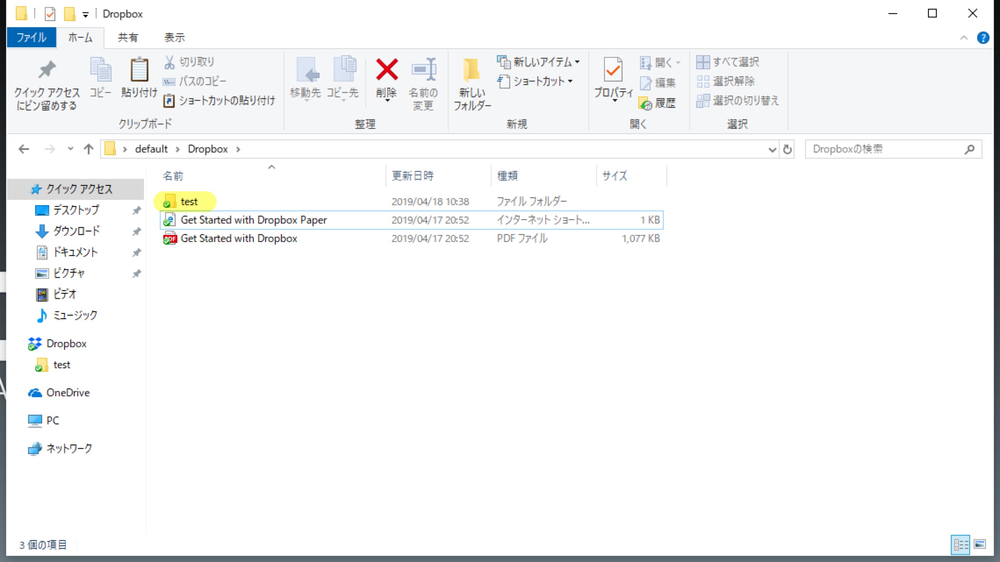

```{r setup, include=FALSE}
knitr::opts_chunk$set(
  echo = FALSE,
  error = TRUE,
  warning = TRUE,
  message = TRUE,
  R.options = list(width = 100)
)
```

## はじめに {#Intro}

[Dropbox](https://www.dropbox.com)はクラウドストレージサービスの一つです。
他にも[Google Drive](https://www.google.co.jp/drive/apps.html)や[OneDrive](https://onedrive.live.com/about/ja-jp/)などもありますが、基本的に使い方は同じです。

<aside>
  Linuxクライアントを出しているのがDropboxしかないから使っているだけでおすすめしているわけではありません。
</aside>

### クラウドストレージとは*

専門家ではないのでざっくりとした説明になりますが、クラウドストレージとはオンライン上にデータを保存できるサービスのことです。
そうすることで自分のPCからだけでなく、他のPCやスマートフォン、タブレットからもデータにアクセスすることができます。

さらに、フォルダを同期することでいちいちファイルをダウンロード・アップロードせずにクラウドストレージに保存することができます。
フォルダを他者と共有することでデータのやり取りをシームレスに行うこともできます。

## Dropboxのインストール {#Install}

まず、Dropboxのアカウントを持っていない人は作成し、持っている人はログインします。

```{r}

```

するとクラウド上に保存されているファイルなどが表示されます。
右上の丸いアカウントボタンをクリックして、インストールを選択します。

```{r}

```

インストーラーをダウンロードし、Dropboxをインストールすると、PC内にDropboxというフォルダが作成されます。

```{r}

```

- 無料アカウントだと3台のデバイスまでしかインストールできないので、上限に達した場合は他のデバイスからアンインストールするか、新しいアカウントを作成してください。

## ファイルとフォルダの共有 {#Sharing}

Dropboxではファイルやフォルダを他者と共有できます。
共有の方法と権限の関係がいまいちよくわからないので自信はないですが、以下のようになっているはずです。

1. フォルダの共有
    - メールによる共有：閲覧のみor編集可能を選択できる。
    - リンクによる共有：閲覧のみ。
1. ファイルの共有
    - メールによる共有：閲覧のみ。
    - リンクによる共有：閲覧のみ。

以下では`test`というフォルダの共有を例にして説明します。
フォルダを開いて「フォルダを共有」選択します。

```{r}

```

- あるいは一覧からフォルダないしファイルにマウスをホバーさせると「共有」というボタンが表示されます。

そこで共有したい相手のメールアドレスを入力して共有します。

```{r}

```

- 権限を閲覧のみにするか編集可能にするかを選択できます。
- 後から設定を変更することも可能です。

メールアドレスを受信した人はフォルダを追加すると以下のように自分のPCに共有フォルダ（今回の場合は`test`）が追加されます。

```{r}

```

今後は、共有フォルダ内でファイルやフォルダに変更があれば共有している人全員の中で同じく変更されます。