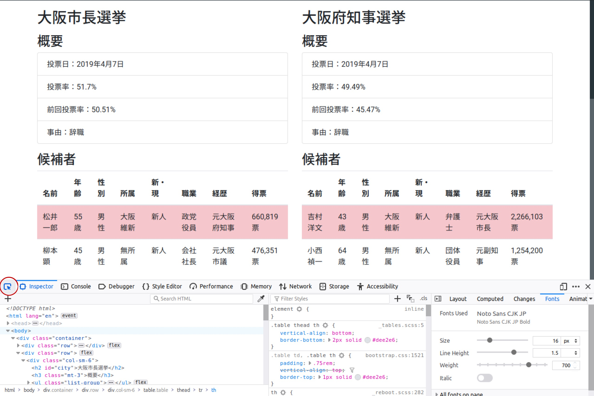
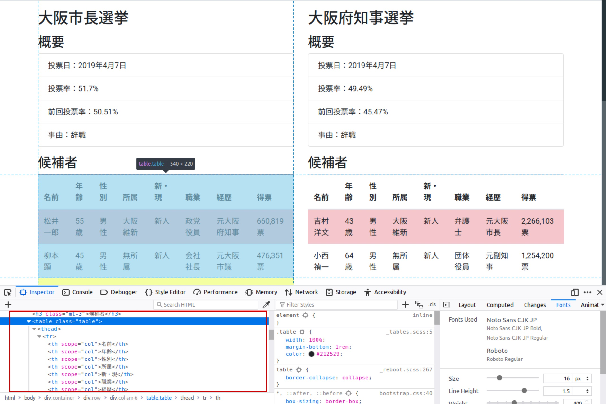

```{r setup, include=FALSE}
knitr::opts_chunk$set(
  echo = TRUE,
  error = TRUE,
  warning = TRUE,
  message = TRUE,
  R.options = list(width = 100)
)
```

## はじめに {#Intro}

クローリングとスクレイピングをすることで定型的には公開されていないデータを自ら作成することができ、分析の幅が広がります。
[APIを使ってやること](../2019-04-18-scraping-twitter/)もできる一方で、APIが公開されていない情報を収集したいこともよくあります。

今回はAPIを使わずに、`.html`ファイルをスクレイピングする方法を説明します。

### 必要なパッケージの読み込み

ウェブスクレイピングにおいて役立つパッケージは`rvest`です。

```{r}
library(tidyverse)
library(rvest)
library(lubridate)
```

## スクレイピング {#Scraping}

大抵の場合、必要な情報は一つのページにあるということはなく、いくつものページをクローリングすることになりますが、まずは一つのページでスクレイピングして、うまくいったらクローリングと組み合わせて複数のページの情報収集をする方がよいでしょう。

ここでは、例として[2019年、大阪のダブル選挙](../2019-04-19-intro-html/bootstrap4.html)を題材にスクレイピングをしたいと思います。

### .htmlファイルの読み込み

まずは、`.html`ファイルを読み込む必要があります。
`rvest`の`read_html()`に読み込みたいウェブサイトのURLを入力します。

```{r}
html <- read_html("https://shohei-doi.github.io/notes/posts/2019-04-19-intro-html/bootstrap4.html")
html
```

- この段階では`head`と`body`を正しく読み込めているかを確認します。

### 表の読み込み

表を抜き出すには`html_table()`に先程読み込んだ`.html`ファイルを入力します。

```{r}
results <-html %>% 
  html_table()
results
```

- 今回は表が2つあるのでデータフレームのリストが返ってきました。

### タグの中身の読み込み

特定のタグの中身を読み込む際には、`html_nodes()`でノードを指定し、`html_text()`でテキストを抽出します。
例えば、選挙の名前がほしいとします。
選挙の名前は`h2`タグなので、以下のように指定します。

```{r}
elections <- html %>% 
  html_nodes("h2") %>% 
  html_text()
elections
```

### リンクの読み込み

リンク先のURLを取ってきたい場合もあります。
URLは`a`タグの中の`href`という属性なので、次のように`html_attr()`によって取得できます。

```{r}
link <- html %>% 
  html_node("a") %>% 
  html_attr("href")
link
```

- 'html_node()`では一つのノードを、`html_nodes()`では複数のノードを指定します。

### CSSパスによる指定

例えば、当選者の情報だけが欲しいとします。
このようなときはCSSパスによって指定することができます。
具体的には以下のように記述します。

```{r}
elected <- html %>% 
  html_nodes(css = ".table-danger") %>% 
  html_text()
elected
```

### Xpathによる指定

はXpathによって指定することもできます。
`.html`ファイルは入れ子構造になっています。
例えば、大阪市長選挙の結果は

1. `html`タグの中の
1. `body`タグの中の
1. `container`クラスの`div`タグの中の
1. 2つめの`div`タグの中の
1. 1つの`col-sm-6`クラスの`divタグの中の
1. `table`タグの中の

にあります。
このような入れ子構造を記述したものをXpathと呼びます。

<aside>
  HTMLはウェブサイト用のXMLのようなものなのでXpathと呼びます。
</aside>

```{r}
city <- html %>% 
  html_node(xpath = "/html/body/div/div[2]/div[1]/table") %>% 
  html_table()
city
```

Xpathでも`class`や`id`を使った指定ができます。

```{r}
city <- html %>% 
  html_node(xpath = "/html/body/div/div[@class = 'row']/div[1]/table") %>% 
  html_table()
city
```

`//`とすることで一部省略することもできます。

```{r}
city <- html %>% 
  html_node(xpath = "//div[@class = 'row']/div[1]/table") %>% 
  html_table()
city
```

### ブラウザを使ったCSSセレクタとXpathの検索

実際問題、CSSパスとXpathをどうやって調べるのかという問題があります。
第一歩は実際のソースファイル（つまり`.html`ファイル）を見ることです。

ウェブサイト上で右クリックをすると`View Page Source`のようなものが出てくるはずなのでそれを選択します。

- ここではFirefoxを使っていますが、Google Chromeでも同じことはできるはずです。
- EdgeとかInternet Explorerとかは知りません。

簡単なサイトであればソースファイルを見ればなんとなく分かるのですが、ちょっと複雑なサイトになるとそれすら危ぶまれます。
そのような場合はInspect機能を使います。

Firevoxの場合、右クリックをして`Inspect Element`をクリックするか、設定の中の`Web Developer`の中の`Inspect`をクリックすると、ブラウザ株にいろいろな表示が出てきます。

この左上のボタンをクリックするとインスペクトモードになるので、知りたい場所にマウスを持っていきます。

```{r, echo = FALSE}

```

うまく選択できない場合は左下のHTMLの箇所で微調整します。

```{r, echo = FALSE}

```

知りたいノードのタグにマウスを持っていき、右クリックをすると`Copy`の中に`Xpath`や`CSS Path`をコピーする選択肢があるはずなので、それを選びます。

## データクリーニング {#Cleaning}

ある程度、`.html`ファイルからデータを抜き出すことができましたが、分析に使うにはまだ遠いでしょう。
ここでは、いくつかのデータのクリーニングの方法を紹介します。

### データの結合

今のところ、`results`には大阪市長選挙と大阪府知事選挙の結果がそれぞれ別のデータフレームとして入っています。
分析するときはこれを結合したいわけですし、なんなら選挙の名前`elections`も入れたいわけです。
そのようなときは`for`文を使ってこのようにします。

```{r}
data <- NULL
for (i in 1:length(results)) {
  data <- bind_rows(data, 
                    results[[i]] %>% 
                      mutate("選挙" = elections[i]))
}
data
```

1. まず、データの格納先として`data`という`NULL`オブジェクトを作成します。
1. 選挙結果の数は`results`に含まれているデータフレームの数なので、`1`から`length(results)`までループを回します。
1. `data`に新しいデータを作成して`bind_rows()`で結合していきます。
    1. 新しく結合するデータは`results`の`i`番目のデータフレームで、それに`i`番目の選挙の名前を新しい変数として付け加えています。
    
<aside>
  リストの場合、番号は`[]`ではなく、`[[]]`で指定します。
</aside>

### データのパース

文字列から必要なデータをパースしたいときがあります。
例えば、選挙結果のうち年齢と得票数は数字だけを抜き出したいのが人情です。
そのようなときは`readr`の`parse_number()`を使います。

```{r}
data <- data %>% 
  mutate("年齢" = parse_number(年齢),
         "得票" = parse_number(得票))
data
```

ここまで来ると、地方公共団体のレベルや地名も知りたくなってしまいます。
そのようなときは`stringr`というパッケージを使います。

まず、選挙が行われた地方公共団体が「都道府県」なのか「市区町村」なのかに興味があるとします。
このようなときは選挙の名前に「知事」が入っていれば前者、「長」が入っていれば後者なので、`str_detect()`という関数で特定の単語が含まれているかを調べ、それに応じた変数の値を作成します。

```{r}
data <- data %>% 
  mutate("地方公共団体" = if_else(str_detect(選挙, "長"), "市区町村", "都道府県"))
data
```

続いて地名を抜き出したいですが、全ての都道府県と市区町村の名前と一致するかを調べるのはほぼ無理です。
そこで逆に考えると、市区町村の場合は「長選挙」を、都道府県の場合は「知事選挙」を取り除けば地名になります。
そこで、`str_remove()`を使います。

```{r}
data <- data %>% 
  mutate("地名" = str_remove(選挙, "(長選挙|知事選挙)"))
data
```

### リストの抜き出し

ほしいデータが必ずしも表形式になっているとは限りません。
例えば、選挙の概要はリスト形式になっています。

```{r}
overview <- html %>% 
  html_nodes("ul")
overview
```

このような場合、まずは一つのリストを使ってどのような処理をしたいかイメージをつけていきます。
まず、1番目のリストの`li`タグの中のテキストを抜き出して`temp`というオブジェクトにします。

```{r}
temp <- overview[1] %>% 
  html_nodes("li") %>% 
  html_text()
temp
```

続いて、これをデータフレームに変換します。

```{r}
temp <- tibble(x = temp)
temp
```

さて、変数の名前と値は`:`で区切られていることがわかります。
そこで、前半を`y`、後半を`x`のようにしたいと思います。

特定の文字を抜き出すときは`str_extract()`を使います。
ここでは具体的には`:`およびそれよりも前の部分を抜き出します。

```{r}
temp <- temp %>% 
  mutate(y = str_extract(x, "[０-９ぁ-んァ-ヶー一-龠]+："))
temp
```

- `[０-９ぁ-んァ-ヶー一-龠]`とは正規表現で全角文字全てを意味します。
- `+`は正規表現で直前の文字が一文字以上あることを意味します。
- `:`は区切りの目印となる文字です。

`:`は不要なので`str_remove()`で除去します。

```{r}
temp <- temp %>% 
  mutate(y = str_remove(y, "："))
temp
```

同様に変数の値も抜き出してもいいのですが、`str_remove`を応用することもできます。

```{r}
temp <- temp %>% 
  mutate(x = str_remove(x, "[０-９ぁ-んァ-ヶー一-龠]+："))
temp
```

ロング形式になっているので、ワイド形式にします。

```{r}
temp <- temp %>% 
  spread(key = y, value = x)
temp
```

選挙の変数を追加します。

```{r}
temp <- temp %>% 
  mutate("選挙" = elections[1])
temp
```

前回投票率と投票率の変数から数値をパースします。

```{r}
temp <- temp %>% 
  mutate("投票率" = parse_number(投票率),
         "前回投票率" = parse_number(前回投票率))
temp
```

さて、最後に投票日ですが、どの情報を抜き出すべきかは分析内容に寄ります。
しかし、年、月、日のどれを取り出すにせよ、これまでの技術を応用するだけなので、ここではRにおける日付データを作成します。
`lubridate`というパッケージを使うと年月日が出てくる順番に対応した関数に入れると日付データにしてくれます。

```{r}
temp <- temp %>% 
  mutate("投票日" = ymd(投票日))
temp
```

ここまで来れば、あとはコードをまとめてループを回すだけになります。
これまで`1`にしていたところを`i`にするのを忘れないでください。

```{r}
data_overview <- NULL
for (i in 1:length(overview)) {
  x <- overview[i] %>% 
    html_nodes("li") %>% 
    html_text()
  data_overview <- bind_rows(data_overview,
                             tibble(x = x) %>% 
                               mutate(y = str_extract(x, "[０-９ぁ-んァ-ヶー一-龠]+：")%>% 
                                        str_remove("："),
                                      x = str_remove(x, "[０-９ぁ-んァ-ヶー一-龠]+：")) %>% 
                               spread(key = y, value = x) %>% 
                               mutate("選挙" = elections[i],
                                      "投票率" = parse_number(投票率),
                                      "前回投票率" = parse_number(前回投票率),
                                      "投票日" = ymd(投票日)))
}
data_overview
```

最後はこのデータを`data`に結合します。

```{r}
data <- left_join(data, data_overview, by = "選挙")
data
```
